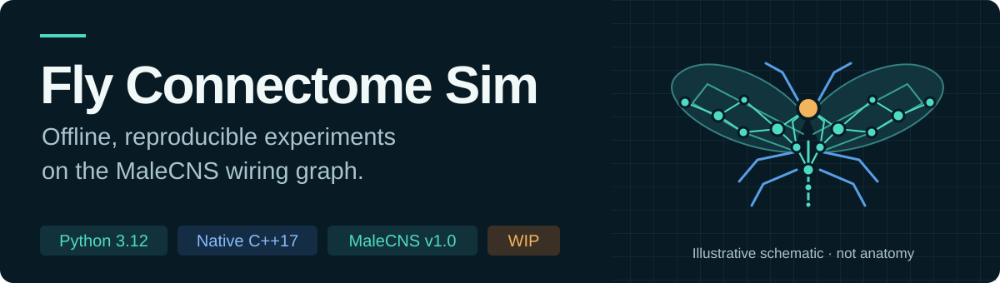
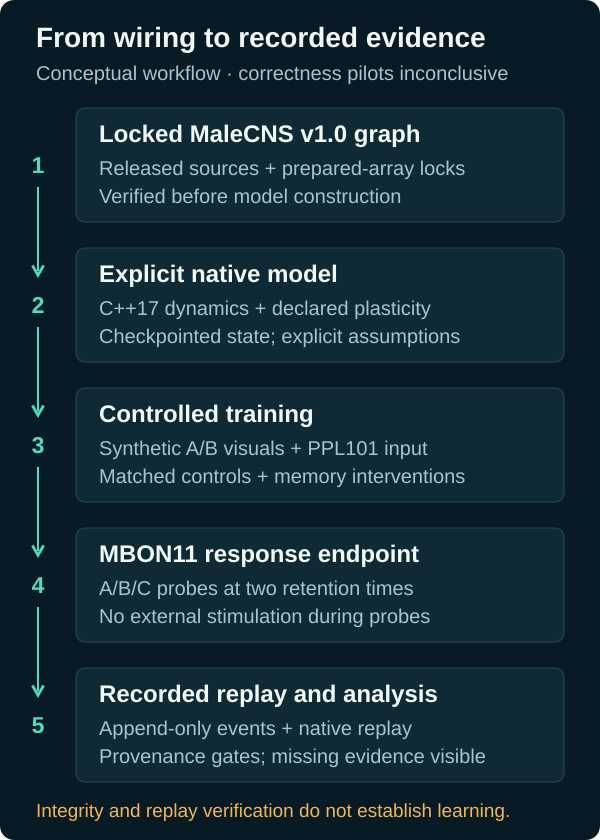

  <a href="#current-status">Status</a> ·
  <a href="#the-assay">The assay</a> ·
  <a href="docs/getting-started.md">Getting started</a> ·
  <a href="#provenance">Provenance</a>

An offline experiment built on the released **MaleCNS v1.0** wiring graph.
The first goal is to test a declared KC → MBON11 associative-plasticity mechanism
using controlled visual stimuli and explicit PPL101 stimulation.

**Work in progress: native correctness pilots have not established scientific support.**
Formal full-graph qualification and confirmation have not run. Bounded fullgraph
resource pilots have run, but whole-assay capacity and a production frozen
configuration have not been established. No positive
plasticity or learned-behavior result is claimed.

The graph supplies wiring and annotations. Physiology, plasticity and action
mappings are explicit model choices. This is not a complete living fly, and it
does not establish consciousness, semantic understanding, dopamine concentration
or receptor occupancy. The MBON11 endpoint does not establish a learned
left/right preference.

## Current status

| Area | Implemented | Still to establish |
| --- | --- | --- |
| Data | Checksum-locked MaleCNS v1.0 sources; prepared graph verified at **166,700 cells** and **25,582,938 directed edges** | Formal assay qualification and confirmation on the full graph |
| Native model | C++17 kernel; explicit PAM11/PPL101 stimulation; KC, MBON07, MBON11 and DNa02 telemetry | Physiological validity beyond the declared model |
| Experiment state | Checkpoint restore, complete-state hashes, reset determinism and candidate-memory interventions | A qualified production frozen configuration |
| Assay evidence | Complete eight-cohort tiny-native production, independent A/B/C trials, two retention times, provenance-bound reports and native replay verification | Selected qualification evidence, fullgraph held-out confirmation and the `assay` CLI |
| Resource pilots | Bounded fullgraph components and an actual trained one-anchor pilot with isolated native replay | Longer-retention costs, whole-assay capacity and a tested cloud/Linux environment |
| Product | Scientific foundation for the event-planning experiment | Separately labelled motor readout, offline 3D replay and LLM event planning |

Implementation and verification details live in the
[assay plan](docs/superpowers/plans/2026-09-24-associative-plasticity-assay.md).
The [assay design](docs/superpowers/specs/2026-09-24-associative-plasticity-pivot-design.md)
defines the scientific boundaries; the [product specification](docs/specs/fly-event-planner.md)
describes the future event planner.

For a fresh cloud checkout, start with the versioned
[cloud handover and live TODOs](docs/cloud-handover.md). Local runtime data,
toolchains and private working notes are not part of the repository.

## The assay

Present synthetic A/B stimuli, pair one with PPL101 stimulation, then measure
A/B and neutral C probes **without external stimulation**. Compare matched
controls and necessity, sufficiency and sham interventions at two retention
times using the frozen MBON11 response endpoint.

- **Locked inputs:** released source checksums, normalized metadata and prepared
  array locks gate model construction.
- **Controlled state:** counterbalanced protocols, complete-state validation and
  separate candidate/noncandidate content hashes support auditable interventions.
  Content equality alone does not prove donor history or clock compatibility.
- **Recorded evidence:** append-only events, durable retention anchors and
  isolated native replay support validated-prefix and sealed reports. Missing
  assay cells remain visible and yield an inconclusive result.

The ordinary `verify-run` command checks artifact integrity. Native replay is a
separate verification path; an intact artifact is not evidence of learning.

## Getting started

The exercised Windows environment uses **Python 3.12.14**, **uv 0.12.15**,
**Zig 0.16.0** and **Node.js 25.9.0**. The numerical kernel uses C++17; Python
coordinates data preparation, protocols and analysis. Node.js downloads the
released data.

Follow [Getting started](docs/getting-started.md) for the complete toolchain
setup, locked data download and verification, preparation, experiment commands
and tests. Allow space for the 1.1 GB source download plus generated outputs.
Linux/macOS have an existing build path; that environment has not been locally
verified or compiler-pinned.

## Provenance

The numerical core is adapted from MIT-licensed Stonkfly/DOOMFLY work through a
checksum-pinned Fly/Wirehead revision. Exact revisions and the retained notice
are documented in [THIRD_PARTY.md](THIRD_PARTY.md) and
[the upstream MIT notice](licenses/stonkfly-MIT.txt).

MaleCNS data is distributed separately under **CC BY 4.0**. Attribution and
citation details are provided by the
[official MaleCNS release](https://male-cns.janelia.org/download/). Raw data and
generated runtime artifacts remain outside Git. These third-party terms do not
declare a license for the project-owned code.
